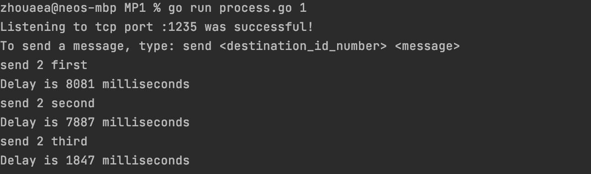
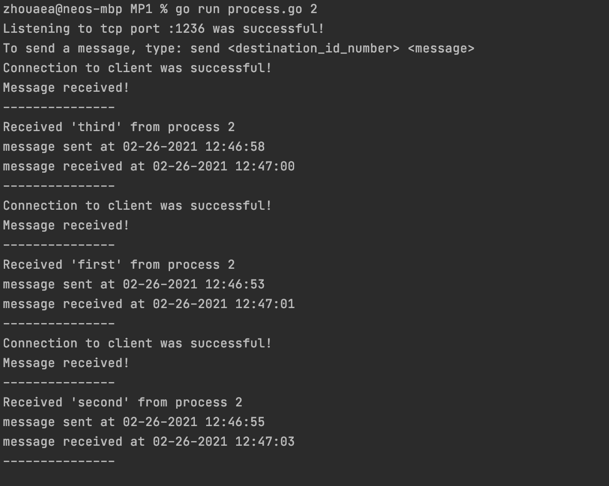

## MP1
MP1 allows multiple processes written in Go 
to send and receive text messages from each other using TCP channels, 
simulating bounded network delay.

## Screenshots (Two Process Example)
### Process 1:


### Process 2:


## How to Run
1. Set the minimum delay, maximum delay, tcp ports, and number of nodes you want to use 
   in the configuration file `nodes.txt`
1. Start a process, passing in an ID found in the nodes.txt configuration file.
```bash 
go run process.go 0
```
3. Follow printed instructions of process in terminal. Type `quit` when finished with a process.

## Package Design
### Main
Uses helper functions as goroutines to simultaneously send and receive messages via tcp.
### TCP
Supports listening to TCP ports and establishing connections to other TCP ports.
### Initialization
Parses initial command line argument and configuration file.
### Messages
Contains a message struct and provides functions that use gob to 
encode and decode it for transmission through a TCP channel.
### Error Checker
Handles errors.
### Config
Contains text file with minimum delay, maximum delay, and node information.

## Exit Codes:
- `0`: Successful
- `1`: Incorrect command line input format
- `2`: External package function error

## References
- My error checking function, `CheckError()`, is a modified version of sample code from [Network Programming with Go](https://ipfs.io/ipfs/QmfYeDhGH9bZzihBUDEQbCbTc5k5FZKURMUoUvfmc27BwL/socket/tcp_sockets.html).
- My exact implementation of establishing a TCP connection on both client and server side was taken from [this linode tutorial](https://www.linode.com/docs/guides/developing-udp-and-tcp-clients-and-servers-in-go/).
- I used code from [golangprograms.com](https://www.golangprograms.com/regular-expression-to-get-a-string-between-parentheses-in-golang.html)
in order to parse minimum delay and maximum delay from the configuration file `node.txt`

